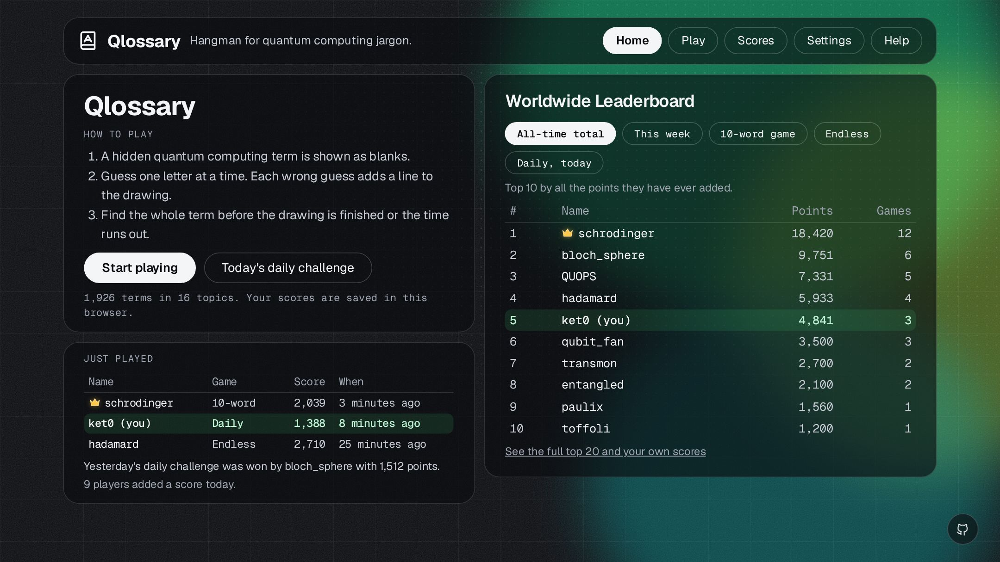
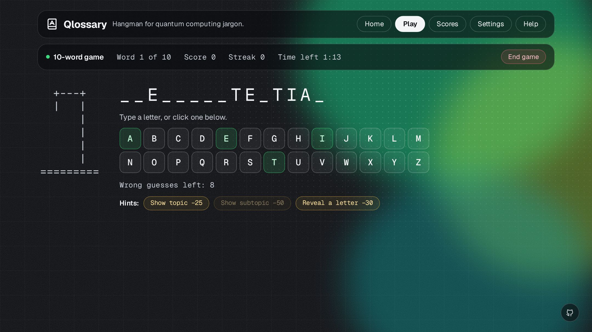
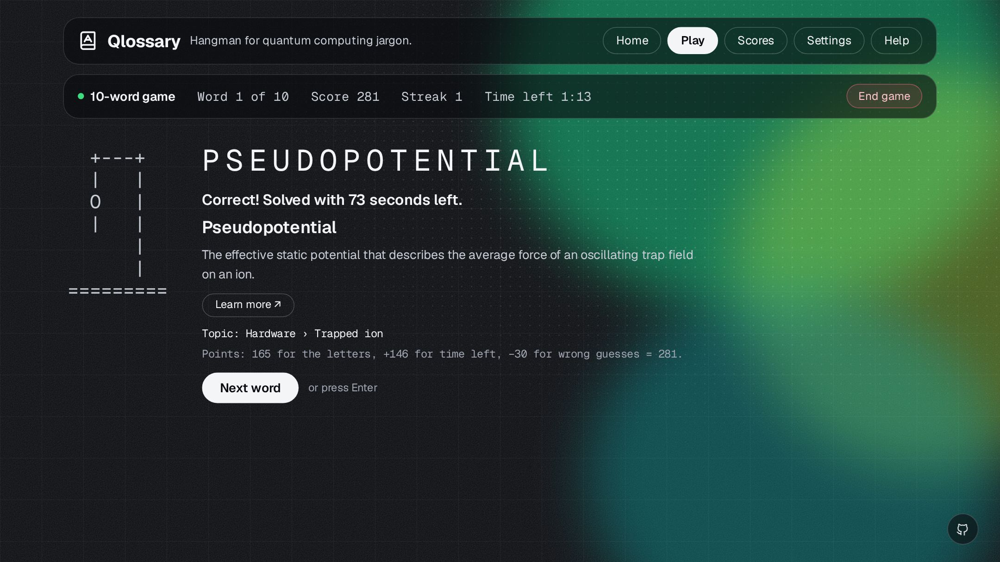
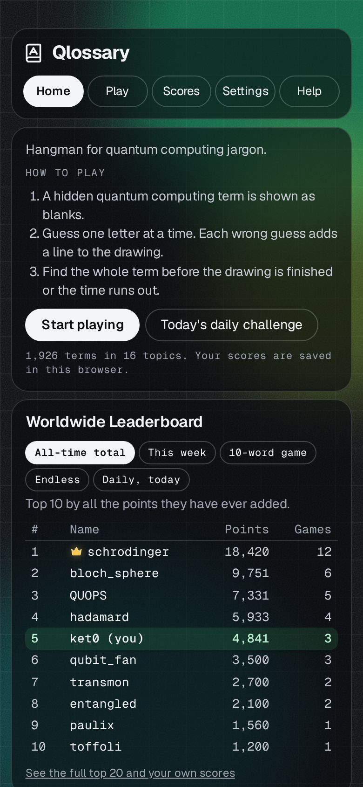
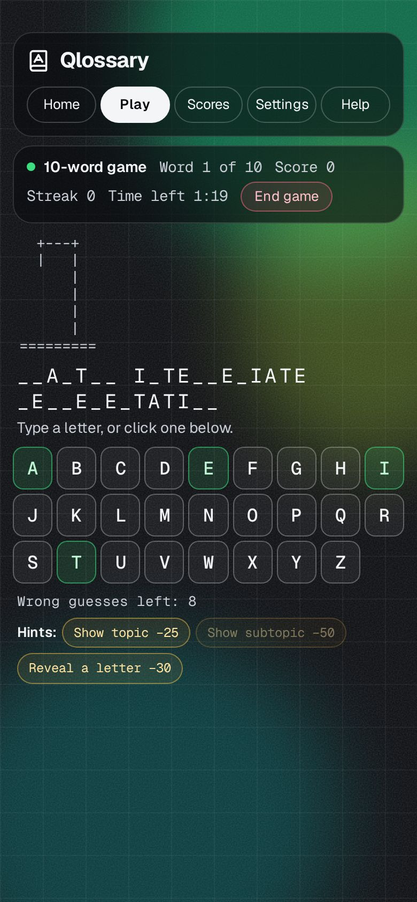
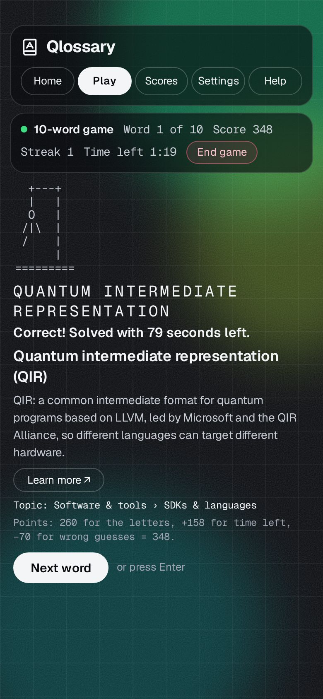

<div align="center">


# Qlossary

**Hangman for quantum computing jargon.**

Guess your way through 1,926 terms in 16 topics, from foundations and gates to
hardware, error correction and error mitigation, learn what each one means, and
climb the worldwide leaderboard.

[](https://github.com/saadbhattii/Qlossary/actions/workflows/ci.yml)
[](LICENSE)


</div>

---

## Screenshots

<table>
  <tr>
    <td colspan="3"></td>
  </tr>
  <tr>
    <td colspan="3"></td>
  </tr>
  <tr>
    <td colspan="3"></td>
  </tr>
  <tr>
    <td></td>
    <td></td>
    <td></td>
  </tr>
</table>

## Play

Open **[qlossary.pages.dev](https://qlossary.pages.dev)** in any browser, on a
phone or a computer. There is nothing to install and no account to make.

1. A hidden quantum computing term is shown as blanks.
2. Guess one letter at a time: type it, or tap it on the keyboard.
3. Each wrong guess adds a line to the drawing. Find the whole term before the
   drawing is finished or the time runs out.
4. After each word you see what it means, with a **Learn more** link.

### Game modes

| Mode | What it is |
| --- | --- |
| **10-word game** | Ten terms, one total score for the leaderboard. |
| **Endless** | Keep going until you miss three terms. |
| **Daily challenge** | Five terms from five topics, the same for everyone, new at midnight UTC, one try a day. |
| **Practice** | No score, and the timer can be turned off. |

**Keys:** letters guess · **1**, **2**, **3** take the hints · **Enter** goes to the next word.

Full rules, scoring, hints and the leaderboard are in the
**[player guide](docs/PLAYING.md)**.

## Features

- **1,926 terms in 16 topics**, every one with a short definition, and a note
  when a word means something else in everyday English or another field.
- **Hints** by topic, subtopic or a revealed letter, each with a points cost.
- **Worldwide leaderboard**: all-time total, this week, best 10-word game,
  best endless run and today's daily. The all-time leader wears a gold crown.
- **Your data stays in your browser.** Scores, progress and settings are kept
  locally and can be moved with Export and Import. Nothing is sent unless you
  press "Add my score".
- **Fast and light:** one page of about 36 KB, no trackers, no outside
  connections, no dependencies. It fits on one screen on desktop and phone.
- **Settings** for topics, difficulty, timer, wrong guesses allowed and term
  length.

---

## For developers

Qlossary is one static HTML page (styles, code, icon and word list inlined)
plus an optional leaderboard on Cloudflare Pages Functions with a D1 database.
It needs only Node 18 or later; Node 22.5+ also runs the leaderboard locally.

```sh
git clone https://github.com/saadbhattii/Qlossary.git
cd Qlossary
npm test          # all test suites
npm run preview   # build, then serve at http://localhost:8788 with the leaderboard
```

| Command | What it does |
| --- | --- |
| `npm run build` | Check the data, then write `dist/` (fails over the size budget). |
| `npm run check` | Check the word list and definitions only. |
| `npm test` | Run the `node:test` suites. |
| `npm run preview` | Build and serve locally with the same headers as production. |

### Documentation

| Guide | For |
| --- | --- |
| [Player guide](docs/PLAYING.md) | Rules, scoring, hints, timer, leaderboard, privacy. |
| [Development](docs/DEVELOPMENT.md) | Setup, scripts, tests, the size budget, project layout. |
| [Architecture](docs/ARCHITECTURE.md) | How the page is built, the modules, data encoding, security headers. |
| [Words and definitions](docs/DATA.md) | Adding terms, topics and definitions, and the rules they must pass. |
| [Leaderboard](docs/LEADERBOARD.md) | API, boards, the crown, anti-cheat checks, moderation. |
| [Deployment](docs/DEPLOYMENT.md) | Cloudflare Pages and D1 setup, migrations, caching. |
| [Design](docs/DESIGN.md) | The look: colours, fonts, layout and rendering rules. |

### Contributing

Contributions are welcome, from a missing term or a better definition to code.
Read **[CONTRIBUTING.md](CONTRIBUTING.md)**, then open an
[issue](https://github.com/saadbhattii/Qlossary/issues/new/choose) or a pull
request. Please follow the [Code of Conduct](CODE_OF_CONDUCT.md), and report
security problems as described in [SECURITY.md](SECURITY.md).

Changes are listed in the **[changelog](CHANGELOG.md)**. AI coding assistants
should start with **[CLAUDE.md](CLAUDE.md)**.

## Licence

The code and word list are under the [MIT licence](LICENSE). The icon is
"book-a" from Lucide (ISC licence), and the Geist fonts are under the SIL Open
Font License 1.1; see [THIRD_PARTY.md](THIRD_PARTY.md).
